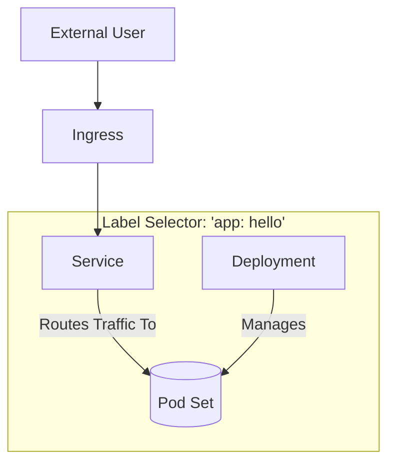

# Kubernetes Basics

This repository contains example files to illustrate basic Kubernetes concepts.

## Core Concepts

### 1. Pod

*   **What it is:** The smallest and simplest unit in the Kubernetes object model that you create or deploy. A Pod represents a single instance of a running process in your cluster.
*   **What it does:** It holds your container(s), storage resources, and a unique network IP. A Pod can contain one or more tightly coupled containers that share these resources.
*   **In this repository:** `hello-pod.yaml` defines a single Pod running a "hello" application container.

### 2. Deployment

*   **What it is:** A higher-level object that manages a set of identical Pods.
*   **What it does:** It ensures that a specified number of Pod "replicas" are running at any given time. If a Pod crashes, the Deployment's controller will automatically replace it. It also provides mechanisms for rolling updates and rollbacks.
*   **Relationship:** A Deployment manages Pods. You describe a desired state in a Deployment, and the Deployment controller changes the actual state to the desired state at a controlled rate.
*   **In this repository:** `hello-deployment.yaml` defines a Deployment that manages two replicas of the "hello" application Pod.

### 3. Service

*   **What it is:** An abstraction that defines a logical set of Pods and a policy by which to access them.
*   **What it does:** Pods are ephemeral and have their own IPs. A Service provides a stable endpoint (a single IP address and DNS name) for a set of Pods. It automatically load-balances traffic across the Pods it targets.
*   **Relationship:** A Service uses a "selector" to find Pods with matching labels. It decouples the frontend (how you access the application) from the backend (the Pods that are actually running).
*   **In this repository:** `hello-service.yaml` creates a stable endpoint for the "hello" Pods managed by the `hello-deployment`.

### 4. Ingress

*   **What it is:** An API object that manages external access to the services in a cluster, typically HTTP.
*   **What it does:** Ingress provides a way to route traffic from outside the cluster to Services within the cluster. It can provide load balancing, SSL termination, and name-based virtual hosting.
*   **Relationship:** An Ingress sits in front of one or more Services. A request from the outside world hits the Ingress controller, which then routes it to the appropriate Service based on the rules defined in the Ingress resource. The Service then forwards the traffic to one of its Pods.
*   **In this repository:** `hello-ingress.yaml` defines rules to route external traffic to the `hello-service`. This requires an Ingress controller like Contour or NGINX to be running in the cluster.

## Summary of Relationships

The following diagram illustrates how these components work together. The key is that both the Service and the Deployment use **label selectors** to target the same set of Pods.

### The Decoupling of Service and Deployment

You are right to question the relationship, as it is indirect and a core concept in Kubernetes.

A **Service** does not know about **Deployments**. A **Deployment** does not know about **Services**.

They are decoupled. The link between them is the **Pod labels**.

1.  A **Deployment**'s job is to create and manage a set of Pods with specific labels (e.g., `app: hello`).
2.  A **Service**'s job is to provide a single, stable network endpoint for all Pods that have that same label (e.g., `app: hello`).

The Service uses its `selector` to find the Pods, and the Deployment uses its `template.metadata.labels` to create them. Because they both act on Pods with the same labels, they work together seamlessly.

This decoupling is powerful. It means you could have multiple Deployments (e.g., for different versions of your app) being pointed to by a single Service, or you could replace the Deployment entirely with another type of controller (like a StatefulSet) without having to change the Service.
